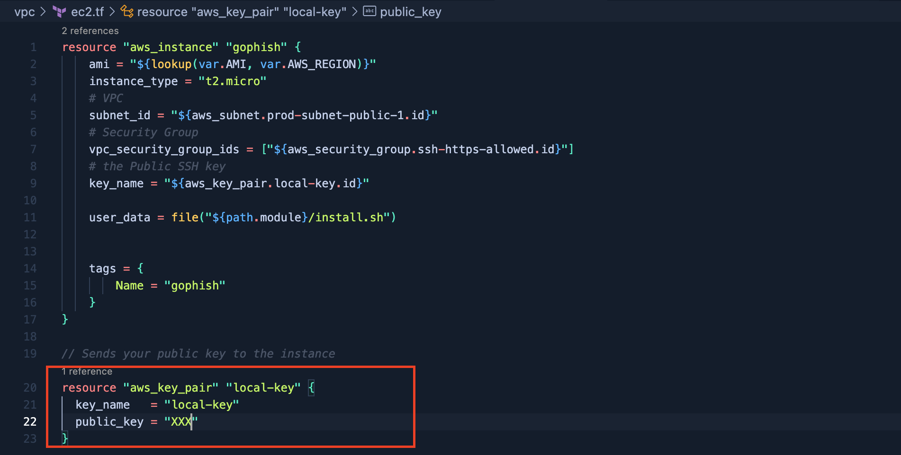

## Terraform VPC & EC2 

To create the a VPC in AWS to run GoPhish As a Service. 

It will be necessary to have:

:one: [Terraform](https://learn.hashicorp.com/tutorials/terraform/install-cli) installed

:two: [AWS programmatic credentials](https://docs.aws.amazon.com/general/latest/gr/aws-sec-cred-types.html)

:three: Your own Domain in Cloudflare


#### Create the Host A 

[Follow this Tutorial](https://www.tech-otaku.com/web-development/using-cloudflare-api-manage-dns-records/#413). You must save ZONE ID & ID to use in next steps.


### Clone the proyect

````
git clone https://github.com/rinehardramos/phishfud
````

### Configure 

You must change the variables on **install.sh** and upload your **public_key** on **ec2.tf**

```
API_EMAIL="XXXXX"
API_KEY="XXXXX"
RECORD_NAME="netflix.XXXX.XXX.XX"
ZONE_ID="XXXXX"
RECORD_ID="XXXXX"
```

### How to Know the Record ID?

```
curl "https://api.cloudflare.com/client/v4/zones/XXXXX/dns_records/" \
     -H "Authorization: Bearer TOKEN" \
     -H "Content-Type:application/json" | jq .
```

<p align="center">

</p>

### Prepare the VPC with the GoPhish Server

```
terraform init
terraform plan
terraform apply 
```

Check the Output. You will have the address to connect by ssh to the instance. Then it will be necessary to know the default password of GoPhish.

<p align="center">

</p>

Search the default password on Syslog

```
grep -n "Please login with the username admin and the password" /var/log/syslog
```

Ready to login on **https://YOURDOMAIN:3333**


